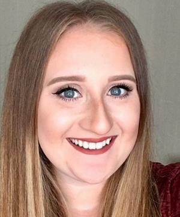

## About me

After successful completion of my degree in BSc Geography at the [University of Liverpool](https://www.liverpool.ac.uk/), I am now studying towards a PhD in [Data Analytics and Society](https://datacdt.org/) also at the University of Liverpool.

  

## Research aims

My research project aims to bridge the gap between large scale Census data and smaller scale community and household data through new data fusion techniques.

